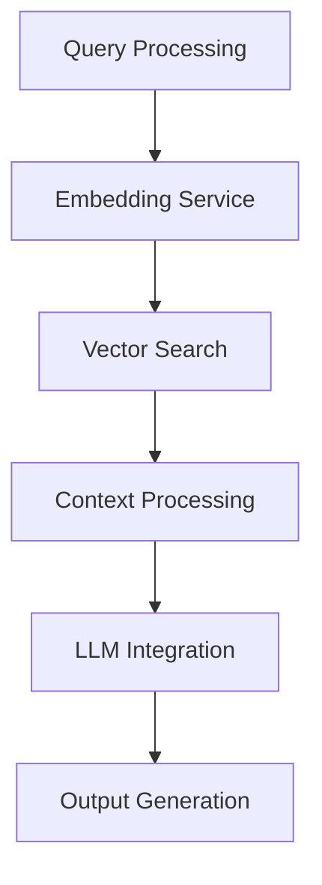
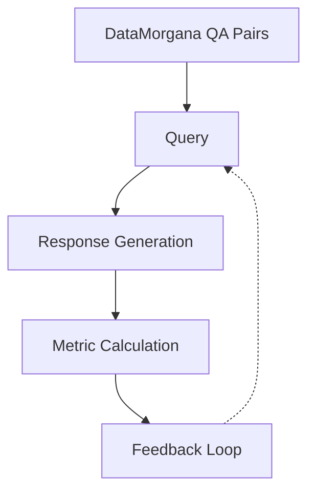

# Technical Context: LiveRAG

## Architecture Overview

LiveRAG follows a modular architecture with the following key components:

## Evaluation Flow

The evaluation process follows this sequence:

## Design Patterns

1. **Service-Oriented Architecture**: Each component (embedding, vector search, etc.) is implemented as a separate service
2. **Interface Pattern**: Multiple interchangeable vector database implementations (Pinecone, OpenSearch)
3. **Repository Pattern**: Abstraction layer for data access operations
4. **Dependency Injection**: Services receive their dependencies rather than creating them
5. Composition over Inheritance

## Development Setup

- Project uses Python with a structured package layout
- Dependencies managed via `pyproject.toml` and `uv.lock` (see `pyproject.toml` for specific dependencies)
- Environment variables configured through `.env` files (see `.env.example` for required variables)
- Python version specified in `.python-version` file

## Coding Preferences

- First rule, AVOID verbose code!
  - Keep code simple and direct
  - Don't add unnecessary abstractions or layers
  - Write clear, focused functions that do one thing well
- If code is not repeated, do not abstract it
  - Only create abstractions when there's clear duplication
  - Premature abstraction leads to unnecessary complexity
  - Simple, direct code is easier to maintain
- Use tsv instead of csv for data storage
- Use `uv add` for package management
- Use `uv run` for running scripts, or `uv run python xxx`, never directly run `python xxx`
- `src/` is installed in editable mode, importing without `src.` prefix
- Use defaults, do not repeat defaults as configuration in code
- For logging, use `from logging_utils import get_logger` and `logger = get_logger('component')`, and `logger.info("hello, %s!", "world", key="value!", more_than_strings=[1, 2, 3])`. Do not verbose log messages, just the key ones.

## Component Relationships

- **Services Module**: Contains core functionality implementations
  - `pinecone_index.py`: Pinecone vector database integration
  - `opensearch_index.py`: OpenSearch vector database integration
  - `embedding_utils.py`: Text-to-vector embedding utilities
  - `aws_utils.py`: AWS integration services
  - `indicies.py`: Common interface for vector indices
  - `ds_data_morgana.py`: DataMorgana integration for Q&A generation

- **Utils Module**: Contains helper utilities
  - `path_utils.py`: File and directory path management
  - `logging_utils.py`: Logging