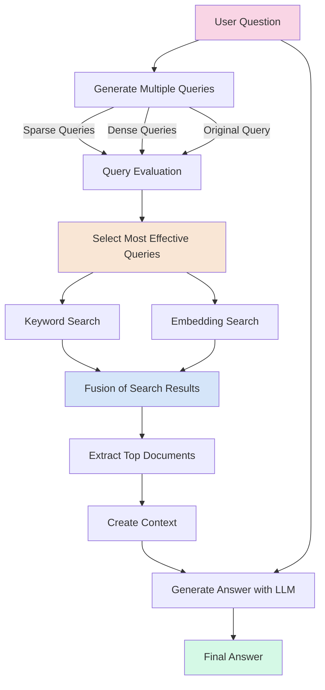

# QPP Fusion RAG System

An advanced RAG implementation that uses Query Performance Prediction (QPP) to select the most effective queries from multiple generated queries and applies fusion search. The system generates both sparse queries (optimized for keyword search) and dense queries (optimized for semantic search), evaluates their effectiveness using QPP metrics, and selects only the most promising queries for the final retrieval.

## How to Run

```bash
uv run scripts/run.py --system systems.qpp_fusion.qpp_fusion_rag.QPPFusionSystem --input data/generated_qa_pairs/dmds_JK09SKjyanxs1.n5.tsv
```

For help with command-line options:

```bash
uv run scripts/run.py --system systems.qpp_fusion.qpp_fusion_rag.QPPFusionSystem --help
```

## Architecture


