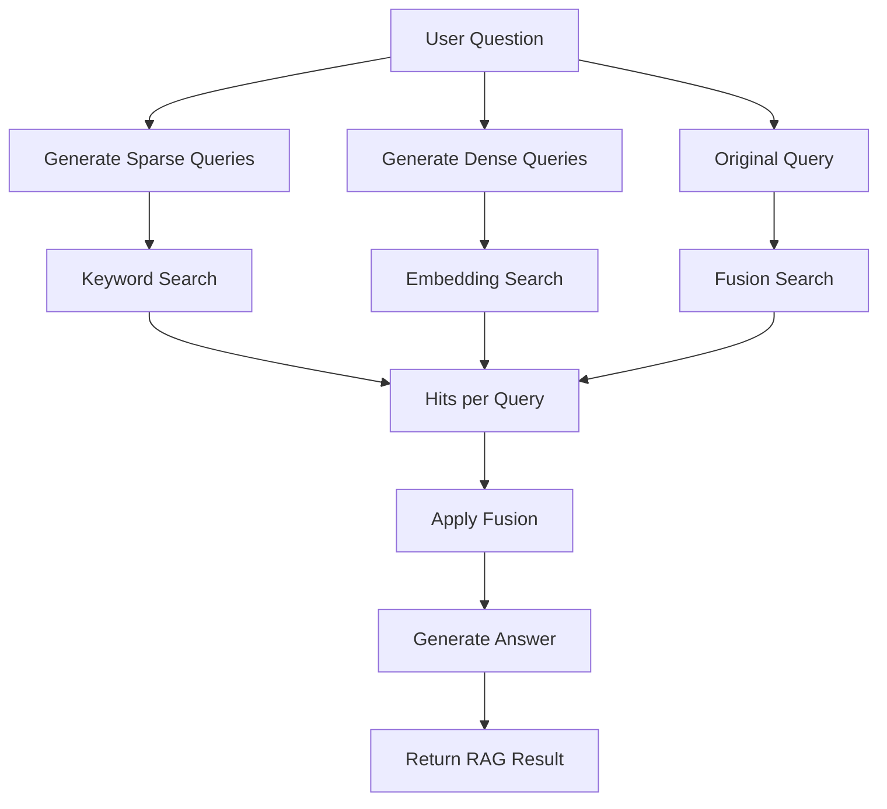

# Rewrite Queries Fusion RAG System

An advanced RAG implementation that rewrites the original question to generate multiple search queries and uses fusion search to improve retrieval quality. The system generates a few alternative queries (configurable), uses fusion search (combining embedding and keyword search) for each query, and applies reciprocal rank fusion to combine results from different queries.

## How to Run

```bash
uv run scripts/run.py --system QPPPostRAG --input data/generated_qa_pairs/dmds_1GMhaG2S7ONAd.multi.n50.tsv
```

For help with command-line options:

```bash
uv run scripts/run.py --system systems.rewrite_queries_fusion_rag.rag.FusionRAGSystem --help
```

## Development Logs

### 2025-04-22

Today I experimented with separating sparse and dense query generation and search, followed by fusion of results. The approach uses:

- Sparse queries optimized for keyword-based search (BM25)
- Dense queries optimized for semantic search (embeddings)
- Fusion of results from both query types

Compared to the basic query rewrite approach, the results weren't significantly better:

| Approach | Avg Relevance Score | Avg Faithfulness Score | Sample Size |
|----------|--------------------:|----------------------:|------------:|
| Basic rewrite | 1.571 | 0.571 | 21 |
| Advanced sparse/dense fusion | 1.500 | 0.656 | 32 |

The advanced approach showed a slight decrease in relevance but a small improvement in faithfulness. This suggests that the additional complexity of separate query generation strategies may not provide substantial benefits over a simpler approach in this context.


